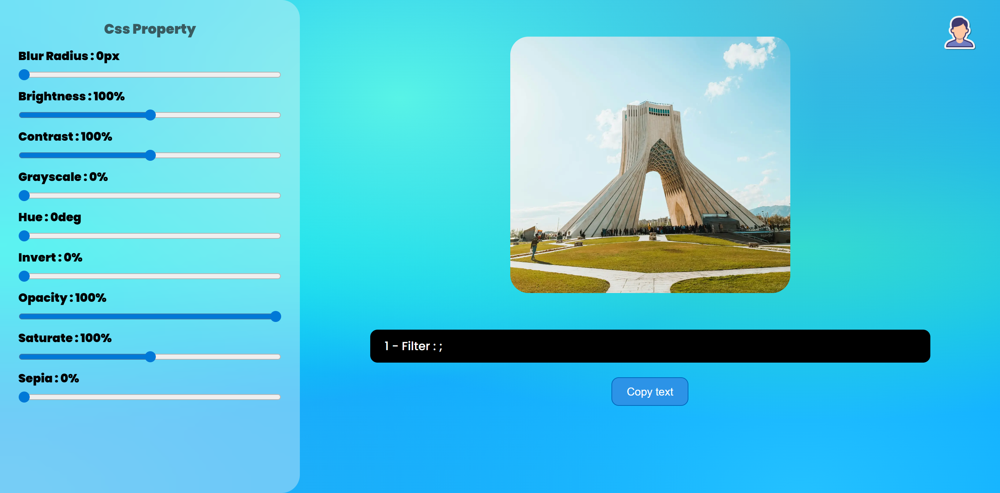
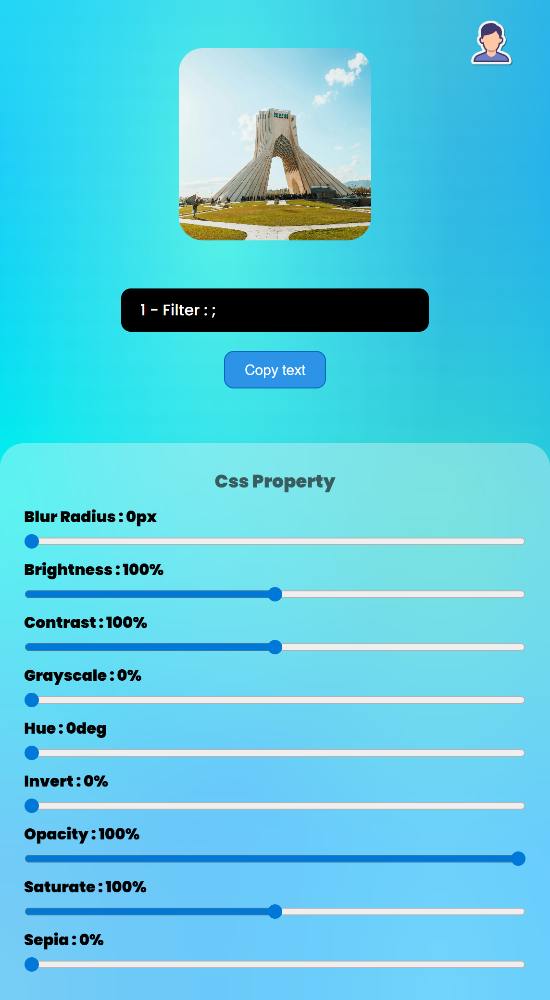

# 🎨 CSS Filter Generator – Photoshop-Like Web Tool (HTML, CSS, JS)

A responsive and interactive **CSS Filter Generator** web tool built using **HTML, CSS, and JavaScript**.  
Inspired by photo editors like Photoshop, this project lets you visually apply CSS filter effects like brightness, contrast, blur, saturation, and more — then copy the generated code instantly!

---

## ✨ Features

- 🎛️ Real-time CSS Filter Controls (Brightness, Contrast, Blur, etc.)
- 🖼️ Live Preview of Uploaded Image
- ⚙️ Auto-generated CSS Code to Copy
- 🧑‍💻 Built with Vanilla JavaScript – No Frameworks
- 📱 Fully Responsive on All Devices

---

## 📅 Created On  
**July 26, 2025**

## 👨‍💻 Developed By  
**Parsa Dehghan Pour Farashah**

## 🔧 Project Mentor  
[@parsa_ghorbanian_web](https://www.instagram.com/parsa_ghorbanian_web)

---

## 🛠️ Tech Stack  
- HTML5  
- CSS3 (with custom UI styling)  
- JavaScript (DOM manipulation & image filters)  
- Media Queries for responsiveness

---

## 🔗 Live Demo  
[👉 Try the Filter Generator Now](https://parsa-farshah.github.io/css-filter-generator/)

---

## 📬 Contact Me

- 📸 Instagram: [@parsa_dehghanpour_dv](https://www.instagram.com/parsa_dehghanpour_dv)  
- 💼 LinkedIn: [Parsa Dehghan Pour Farashah](https://linkedin.com/in/parsa-dehghan-pour-farashah-85ab04250)  
- 💻 GitHub: [parsa-farshah](https://github.com/parsa-farshah)  
- 🎥 YouTube: [@FrontEndFresh](https://www.youtube.com/@FrontEndFresh)  
- 📩 Email: parsafarashah2002@gmail.com

---

## 📸 Screenshots

### 💻 Desktop View

---

### 📱 Mobile View

---

